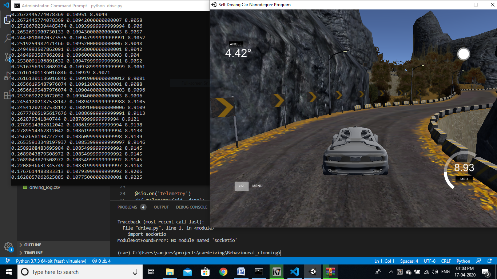
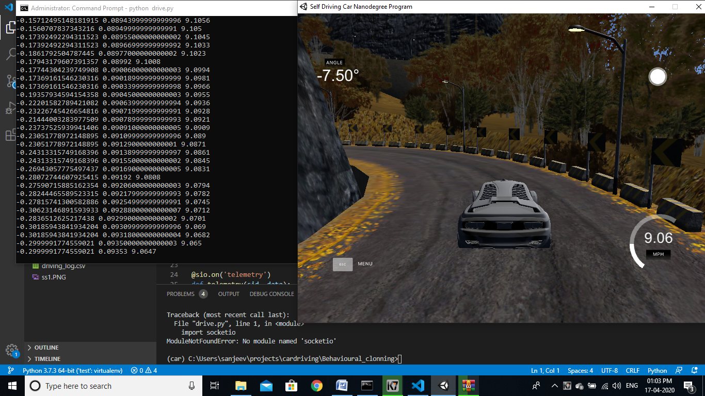

# 🚗 Self-Driving Car — End-to-End Deep Learning & Computer Vision

A complete self-driving car project that combines **classical computer vision** (lane detection) with **deep learning** (behavioral cloning using NVIDIA's CNN architecture). The car learns to drive autonomously in the [Udacity Self-Driving Car Simulator](https://github.com/udacity/self-driving-car-sim) by imitating human driving behavior.




---

## 📑 Table of Contents

- [Project Overview](#project-overview)
- [How It Works (End-to-End Flow)](#how-it-works-end-to-end-flow)
- [Project Structure](#project-structure)
- [Technologies & Dependencies](#technologies--dependencies)
- [Setup & Installation](#setup--installation)
- [Part 1: Lane Detection (Classical Computer Vision)](#part-1-lane-detection-classical-computer-vision)
- [Part 2: Behavioral Cloning (Deep Learning)](#part-2-behavioral-cloning-deep-learning)
- [Part 3: Autonomous Driving (Deployment)](#part-3-autonomous-driving-deployment)
- [NVIDIA CNN Model Architecture](#nvidia-cnn-model-architecture)
- [Data Augmentation Techniques](#data-augmentation-techniques)
- [Troubleshooting](#troubleshooting)
- [References & Credits](#references--credits)

---

## Project Overview

This project has **three major components**:

| Component | Approach | Purpose |
|-----------|----------|---------|
| **Lane Detection** | Classical CV (Canny + Hough Transform) | Detect lane lines on road images/video |
| **Behavioral Cloning** | Deep Learning (NVIDIA CNN) | Train a neural network to predict steering angles from camera images |
| **Autonomous Driving** | Real-time Inference Server | Deploy the trained model to drive a car in a simulator |

The core idea: You drive a car manually in a simulator, record the camera images + steering angles, train a CNN to map images → steering angles, then let the model drive the car autonomously.

---

## How It Works (End-to-End Flow)

```
┌─────────────────────────────────────────────────────────────────────────┐
│                        COMPLETE PIPELINE                                 │
└─────────────────────────────────────────────────────────────────────────┘

Step 1: DATA COLLECTION
┌──────────────────────┐
│  Udacity Simulator   │──→ driving_log.csv (steering, throttle, speed)
│  (Manual Driving)    │──→ IMG/ folder (center, left, right camera images)
└──────────────────────┘

Step 2: MODEL TRAINING (Google Colab)
┌──────────────────────────────────────────────────────┐
│  preprocessing_every_second_image_data.py             │
│                                                      │
│  Load CSV → Balance Data → Augment → Preprocess      │
│  → Build NVIDIA CNN → Train (10 epochs) → model.h5   │
└──────────────────────────────────────────────────────┘

Step 3: AUTONOMOUS DRIVING (Local Machine)
┌──────────────────────┐       WebSocket (port 4567)       ┌──────────────┐
│  drive.py            │◄─────── camera image ─────────────│  Simulator   │
│  (Flask + SocketIO)  │──────── steering + throttle ─────►│  (Autonomous │
│  Loads model.h5      │                                    │   Mode)      │
└──────────────────────┘                                    └──────────────┘
```

---

## Project Structure

```
SelfDrivingCar/
│
├── README.md                                  ← You are here
├── test_image.jpg                             ← Sample road image for lane detection
├── driving_log.csv                            ← Simulator recording (images + steering data)
├── ss1.PNG                                    ← Screenshot of the project
├── ss2.PNG                                    ← Screenshot of the project
│
├── lane.py                                    ← Lane detection on video (working version)
├── 12121.py                                   ← Lane detection on static image (draft)
│
├── findinglanes/                              ← Lane detection module
│   ├── lane.py                                ← Lane detection on video (same as root)
│   └── 12121.py                               ← Lane detection on static image (same as root)
│
├── Behavioural_clonning/                      ← Behavioral cloning module
│   ├── drive.py                               ← Real-time inference server (connects to simulator)
│   ├── model.h5                               ← Trained NVIDIA CNN model weights
│   └── package.json                           ← Node.js metadata (for simulator compatibility)
│
├── preprocessing_every_second_image_data.py   ← FULL training pipeline (run in Google Colab)
├── untitled2.py                               ← Perceptron/linear classifier exercise
└── untitled3.py                               ← Traffic sign classification (incomplete)
```

---

## Technologies & Dependencies

| Library | Version | Purpose |
|---------|---------|---------|
| Python | 3.6+ | Programming language |
| OpenCV (`cv2`) | 4.x | Image processing, edge detection, video I/O |
| Keras / TensorFlow | 2.x | Deep learning framework (NVIDIA CNN) |
| NumPy | 1.x | Numerical computations |
| Flask | 1.x | Web server for SocketIO |
| python-socketio | 4.x | WebSocket communication with simulator |
| eventlet | 0.x | Async networking for real-time inference |
| Pillow (PIL) | 8.x | Image decoding from base64 |
| imgaug | 0.4+ | Data augmentation (zoom, pan, brightness) |
| scikit-learn | 0.x | Train/test split |
| pandas | 1.x | CSV data handling |
| Matplotlib | 3.x | Visualization |

---

## Setup & Installation

### Prerequisites

- Python 3.6 or higher
- [Udacity Self-Driving Car Simulator](https://github.com/udacity/self-driving-car-sim/releases) (download for your OS)
- Google account (for Colab training) OR a local GPU setup
- A video file `test2.mp4` of road footage (for lane detection)

### 1. Clone the Repository

```bash
git clone https://github.com/Rizul-GitHub/SelfDrivingCar.git
cd SelfDrivingCar
```

### 2. Create a Virtual Environment (Recommended)

```bash
python -m venv venv

# Windows
venv\Scripts\activate

# Linux/Mac
source venv/bin/activate
```

### 3. Install Dependencies

```bash
pip install numpy opencv-python matplotlib keras tensorflow flask python-socketio eventlet pillow imgaug scikit-learn pandas
```

Or create a `requirements.txt`:

```
numpy
opencv-python
matplotlib
keras
tensorflow
flask
python-socketio
eventlet
Pillow
imgaug
scikit-learn
pandas
```

Then run:

```bash
pip install -r requirements.txt
```

---

## Part 1: Lane Detection (Classical Computer Vision)

### What It Does

Detects lane lines on road images or video using traditional computer vision techniques — no machine learning involved.

### The Pipeline

```
Input Image/Frame
       ↓
┌─────────────────┐
│  Grayscale      │  Convert RGB → Grayscale
└────────┬────────┘
         ↓
┌─────────────────┐
│  Gaussian Blur  │  Reduce noise (kernel size = 5)
└────────┬────────┘
         ↓
┌─────────────────┐
│  Canny Edge     │  Detect edges (thresholds: 50, 150)
└────────┬────────┘
         ↓
┌─────────────────┐
│  Region of      │  Mask to triangular region (road area only)
│  Interest       │
└────────┬────────┘
         ↓
┌─────────────────┐
│  Hough Lines    │  Detect straight lines in edge image
└────────┬────────┘
         ↓
┌─────────────────┐
│  Average Slope  │  Separate left/right lanes, average them
│  & Intercept    │
└────────┬────────┘
         ↓
Output: Lane lines overlaid on original image
```

### How to Run

**On a static image:**
```bash
# Make sure test_image.jpg is in the same directory
python 12121.py
```

**On a video (recommended):**
```bash
# Make sure test2.mp4 is in the same directory
python lane.py
# Press 'q' to quit the video window
```

### Key Concepts Explained

1. **Canny Edge Detection**: Finds areas of rapid intensity change (edges) in the image using gradient calculations.

2. **Region of Interest**: We only care about the road ahead, so we mask everything outside a triangular region at the bottom-center of the frame.

3. **Hough Line Transform**: Converts edge points into lines by finding points that are collinear. Parameters:
   - `rho = 2` (distance resolution in pixels)
   - `theta = π/180` (angular resolution in radians)
   - `threshold = 100` (minimum votes to detect a line)
   - `minLineLength = 40` (minimum line length in pixels)
   - `maxLineGap = 5` (maximum gap between line segments)

4. **Average Slope/Intercept**: Lines with negative slope = left lane, positive slope = right lane. We average all detected lines per side to get one smooth lane line.

---

## Part 2: Behavioral Cloning (Deep Learning)

### What It Does

Trains a Convolutional Neural Network (CNN) to predict steering angles from dashboard camera images. The model learns by imitating human driving behavior recorded in the simulator.

### Step-by-Step Training Guide

#### Step 1: Collect Training Data

1. Download and open the [Udacity Simulator](https://github.com/udacity/self-driving-car-sim/releases)
2. Select **Training Mode**
3. Drive the car around the track manually (try to stay centered)
4. The simulator records:
   - `driving_log.csv` — steering angle, throttle, brake, speed per frame
   - `IMG/` folder — center, left, and right camera images per frame

The CSV format:
```
center_image_path, left_image_path, right_image_path, steering_angle, throttle, reverse, speed
```

#### Step 2: Train the Model (Google Colab)

1. Open [Google Colab](https://colab.research.google.com/)
2. Upload or copy the contents of `preprocessing_every_second_image_data.py`
3. Run all cells — the script will:

**a) Load & Balance Data**
```python
# Reads driving_log.csv
# Caps samples per steering angle bin at 200 to prevent bias toward straight driving
```

**b) Use All Three Cameras**
```python
# Center image: steering_angle as-is
# Left image: steering_angle + 0.15 (correction to steer right)
# Right image: steering_angle - 0.15 (correction to steer left)
```
This triples the training data and teaches recovery behavior.

**c) Augment Data** (see [Data Augmentation](#data-augmentation-techniques) section)

**d) Preprocess Images**
```python
def img_preprocess(img):
    img = img[60:135,:,:]          # Crop sky and car hood
    img = cv2.cvtColor(img, cv2.COLOR_RGB2YUV)  # Convert to YUV (NVIDIA paper)
    img = cv2.GaussianBlur(img, (3, 3), 0)      # Reduce noise
    img = cv2.resize(img, (200, 66))             # Resize to NVIDIA input size
    img = img/255                                # Normalize to [0, 1]
    return img
```

**e) Build & Train NVIDIA CNN**
```python
model.fit_generator(
    batch_generator(X_train, y_train, 100, 1),
    steps_per_epoch=300,
    epochs=10,
    validation_data=batch_generator(X_valid, y_valid, 100, 0),
    validation_steps=200
)
model.save('model.h5')
```

4. Download the generated `model.h5` file
5. Place it in the `Behavioural_clonning/` folder

---

## Part 3: Autonomous Driving (Deployment)

### What It Does

Runs a real-time inference server that communicates with the Udacity Simulator via WebSocket. The server receives camera images, predicts steering angles using the trained model, and sends control commands back.

### How to Run

```bash
cd Behavioural_clonning

# Start the inference server
python drive.py
```

Then:
1. Open the Udacity Simulator
2. Select **Autonomous Mode**
3. The car will start driving itself!

### How It Works (drive.py)

```python
# 1. Load the trained model
model = load_model('model.h5')

# 2. Start WebSocket server on port 4567
app = socketio.Middleware(sio, app)
eventlet.wsgi.server(eventlet.listen(('', 4567)), app)

# 3. On each telemetry event from simulator:
@sio.on('telemetry')
def telemetry(sid, data):
    # Decode base64 image from simulator
    image = Image.open(BytesIO(base64.b64decode(data['image'])))
    
    # Preprocess (same as training)
    image = img_preprocess(np.asarray(image))
    
    # Predict steering angle
    steering_angle = float(model.predict(np.array([image])))
    
    # Calculate throttle (slow down at high speed)
    throttle = 1.0 - speed/speed_limit
    
    # Send controls back to simulator
    send_control(steering_angle, throttle)
```

### Communication Protocol

| Direction | Event | Data |
|-----------|-------|------|
| Simulator → Server | `telemetry` | `{image: base64, speed: float}` |
| Server → Simulator | `steer` | `{steering_angle: str, throttle: str}` |
| Simulator → Server | `connect` | Connection established |

---

## NVIDIA CNN Model Architecture

The model is based on [NVIDIA's End-to-End Learning for Self-Driving Cars](https://arxiv.org/abs/1604.07316) paper.

```
Input: 66 × 200 × 3 (YUV image)
         ↓
┌─────────────────────────────────────┐
│  Conv2D: 24 filters, 5×5, stride 2  │  → ELU activation
│  Conv2D: 36 filters, 5×5, stride 2  │  → ELU activation
│  Conv2D: 48 filters, 5×5, stride 2  │  → ELU activation
│  Conv2D: 64 filters, 3×3            │  → ELU activation
│  Conv2D: 64 filters, 3×3            │  → ELU activation
└─────────────────────────────────────┘
         ↓
┌─────────────────────────────────────┐
│  Flatten                             │
│  Dense: 100 neurons                  │  → ELU activation
│  Dense: 50 neurons                   │  → ELU activation
│  Dense: 10 neurons                   │  → ELU activation
│  Dense: 1 neuron (steering angle)    │  → Linear (regression output)
└─────────────────────────────────────┘

Optimizer: Adam (learning rate = 0.001)
Loss: Mean Squared Error (MSE)
```

**Why this architecture?**
- Convolutional layers extract visual features (edges, lane markings, road curvature)
- Subsampling (stride 2) reduces spatial dimensions progressively
- Fully connected layers map features to a single steering angle prediction
- ELU activation avoids dead neurons (unlike ReLU)
- MSE loss is appropriate for regression (predicting continuous steering values)

---

## Data Augmentation Techniques

To prevent overfitting and improve generalization, the training pipeline applies random augmentations:

| Technique | What It Does | Why |
|-----------|-------------|-----|
| **Zoom** | Random scale 1.0–1.3× | Simulates being closer/farther from road |
| **Pan** | Random translate ±10% in X and Y | Simulates off-center driving |
| **Brightness** | Random multiply 0.2–1.2× | Simulates different lighting conditions |
| **Horizontal Flip** | Mirror image + negate steering angle | Doubles data, balances left/right turns |

Each augmentation is applied with 50% probability per image, creating diverse training samples from limited data.

---

## Additional Scripts

### `untitled2.py` — Perceptron Visualization

A learning exercise that visualizes a simple linear classifier (perceptron) separating two Gaussian clusters. Demonstrates the foundational concept behind neural networks — finding a decision boundary.

### `untitled3.py` — Traffic Sign Classification (Incomplete)

An incomplete implementation of German Traffic Sign Recognition using a CNN. Uses the [German Traffic Signs Benchmark](http://benchmark.ini.rub.de/) dataset. Only implements data loading and grayscale preprocessing.

---

## Troubleshooting

| Problem | Solution |
|---------|----------|
| `ModuleNotFoundError: No module named 'cv2'` | `pip install opencv-python` |
| `ModuleNotFoundError: No module named 'keras'` | `pip install keras tensorflow` |
| `ModuleNotFoundError: No module named 'imgaug'` | `pip install imgaug` |
| Simulator doesn't connect to `drive.py` | Make sure `drive.py` is running BEFORE launching simulator in autonomous mode |
| Car drives off the road | Collect more training data, especially on curves. Drive multiple laps. |
| `model.h5` not found | Train the model first (Part 2) or ensure the file is in `Behavioural_clonning/` |
| Video not found for lane detection | Place `test2.mp4` in the same directory as `lane.py` |
| Port 4567 already in use | Kill any existing process on that port or restart your machine |
| Training loss not decreasing | Try more epochs, lower learning rate, or collect better training data |

---

## References & Credits

- [NVIDIA End-to-End Learning for Self-Driving Cars (Paper)](https://arxiv.org/abs/1604.07316)
- [Udacity Self-Driving Car Simulator](https://github.com/udacity/self-driving-car-sim)
- [Udacity Self-Driving Car Nanodegree](https://www.udacity.com/course/self-driving-car-engineer-nanodegree--nd013)
- Training data source: [rslim087a/track](https://github.com/rslim087a/track)

---

## License

This project is for educational purposes. Feel free to use and modify.

---

*Built with ❤️ for learning autonomous driving concepts*
